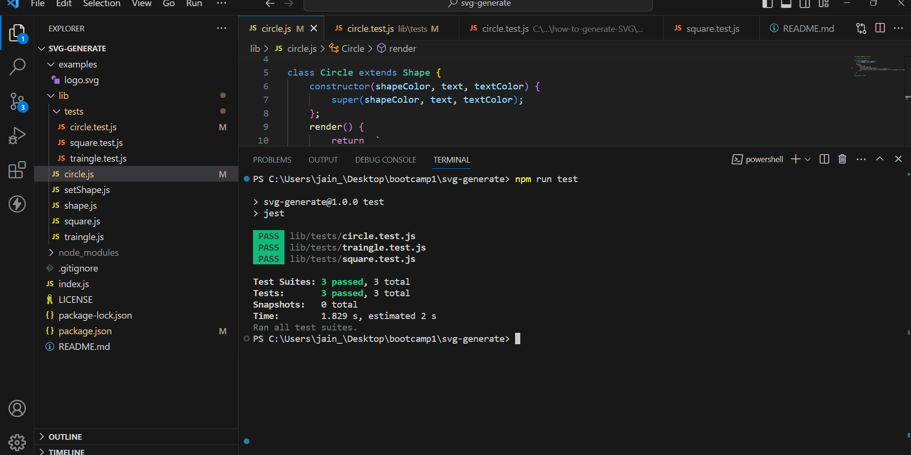

# svg-generate

https://drive.google.com/file/d/1OjaZDTuTORxCckNg2Z0X8ZW6ZtWyyKPB/view

# how-to-generate-SVG

## Description
This project will generate a  SVG logo so that developer can create easily create by terminal.web developers to create custom logos without hiring a graphic designer. i have used package of  [Inquirer package](https://www.npmjs.com/package/inquirer/v/8.2.4) for input form user. and install the package of JEST for testing with a test suite consisting of three tests to ensure accurate shapes and colors.This app showcases the potential of back-end developers and the importance of unit testing. it prompt user to  background color , limiting text input to three characters and text color. It has been three shapes which is circle,square and traingle. 

# github Repo Link
https://github.com/LipikaManglaa/svg-generate.git

SSH LINK: git@github.com:LipikaManglaa/svg-generate.git

# video Link 

https://drive.google.com/file/d/1UFTelmFX6EuS7sLZvCI4eeWcgXJrMiUr/view

## Table of Contents

  
* [Description](#Description)

* [Screenshots](#Screenshots) 

* [Technologies-Used](#Technologies-Used)

* [Testing](#testing)   

* [Installation](#installation)
  
* [Instructions](#Instructions) 
          
* [Questions](#questions)
 
* [Usage](#usage)

* [License](#license)          

## Installation
1. In order to install this project you must clone this project on to your local machine.

2. To install node.js v18 using the terminal, refer to the documentation for the appropriate command. 

3. After installing node.js v18, use the command "npm init -y" in the terminal to create a package.json file for storing project files

4. Using the terminal, run "npm i" to install the application's dependencies. For inquirer and jest, developers can install them directly from the command line using "npm i inquirer@8.2.4" for version 8.2.4 of inquirer and "npm i jest" for the latest version of jest. 
5. Type "node index.js" in the terminal to run the application.

## Usage
This project usage is for anyone that needs a logo how to create for their own  Project!

## Instructions
If you would like to see how to create Logo then you can check my github repo and let you know  how to cretae it

## Testing
To perform unit testing, execute the command "npm run test" in the terminal. Currently, there is a single test suite containing three tests.

 

## Screenshots 
 example of logo

  

  

  

## License
This application is covered under the MIT license

## Questions
Created by: LipikaManglaa

If you have any further questions please feel free to contact me at lipika.mangla.web@gmail.com